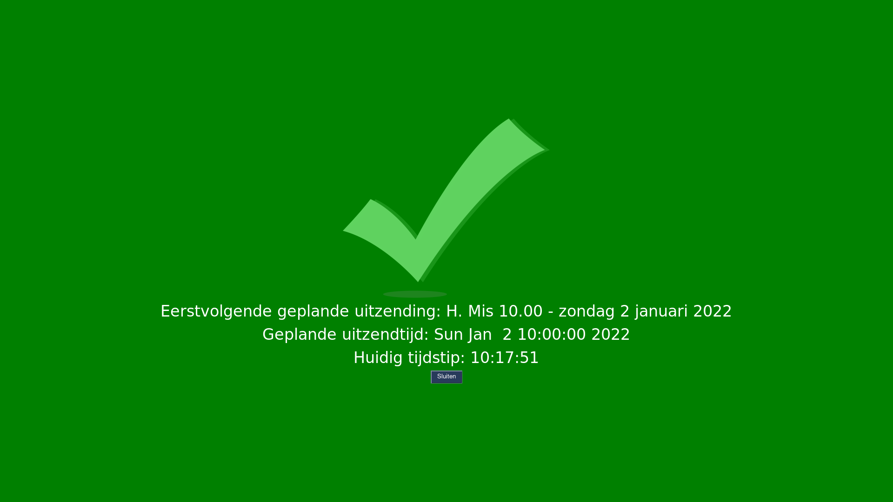

# sbsc

YouTube **s**cheduled **b**roadcast **s**ynchronisation **c**hecker

## Summary

Visual indicator showing whether the current time matches the scheduled broadcast date and time of the next available scheduled broadcast of a specified YouTube channel.

When in sync:

When not in sync:

## Rationale

When using an [Atem Mini](https://www.blackmagicdesign.com/products/atemmini) or similar device to stream a video feed to a streaming platform such as YouTube, a commonly used pattern is to schedule broadcasts in advance. This allows viewers to bookmark upcoming broadcasts of interest.

A downside of this approach is that if a broadcast is missed or accidentally started more then once, the scheduled broadcasts are not in sync with the real world anymore. This is due to YouTube processing scheduled broadcasts by date: as soon as the Atem starts streaming to YouTube, the broadcast with the earliest scheduled broadcast date will go live, even if it's days in the past or the future.

For example, if Thursday's broadcast of the Holy Mass is skipped (e.g. because of problems with the internet connection), then on Friday, YouTube will happily start broadcasting Thursday's scheduled broadcast.

To aid the operator of the Atem (in our case a busy priest, sacristan, acolyte, etc.) in determining whether a broadcast can safely be started, we built a quick visual indicator that shows whether the broadcast date and time of the next scheduled broadcast matches the current time (within a 45 minute margin of error). If it does, a message is shown in green; if it doesn't, it is shown in red.

## Prerequisites

- [PySimpleGUI](https://github.com/PySimpleGUI/PySimpleGUI)
- Your YouTube channel ID
- A [Google API key](https://console.cloud.google.com/apis/credentials)

## Installation

Provide values for the variables in `config.json`, then run the script (e.g. with `./sbsc.py`).

## See also

[sbsc-ansible](https://github.com/majellatech/sbsc-ansible): Ansible playbook for provisioning a Raspberry Pi to launch sbsc at boot.
